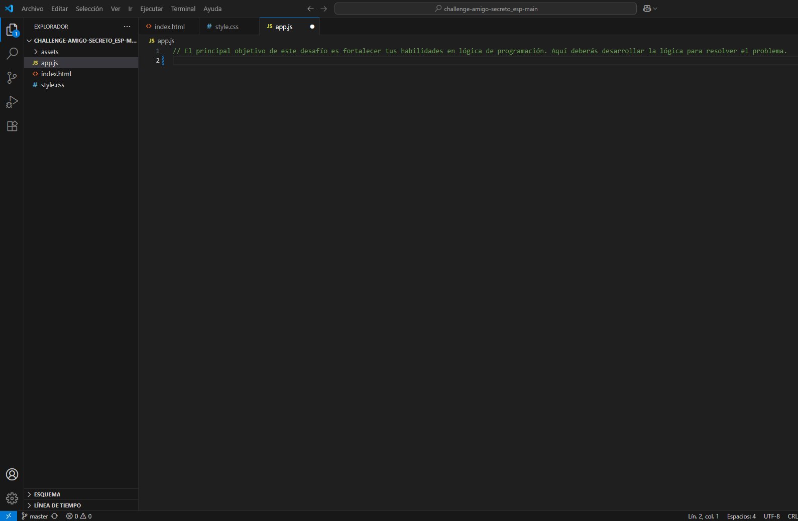
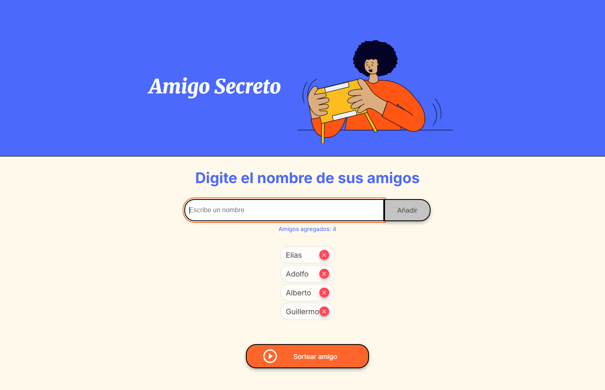
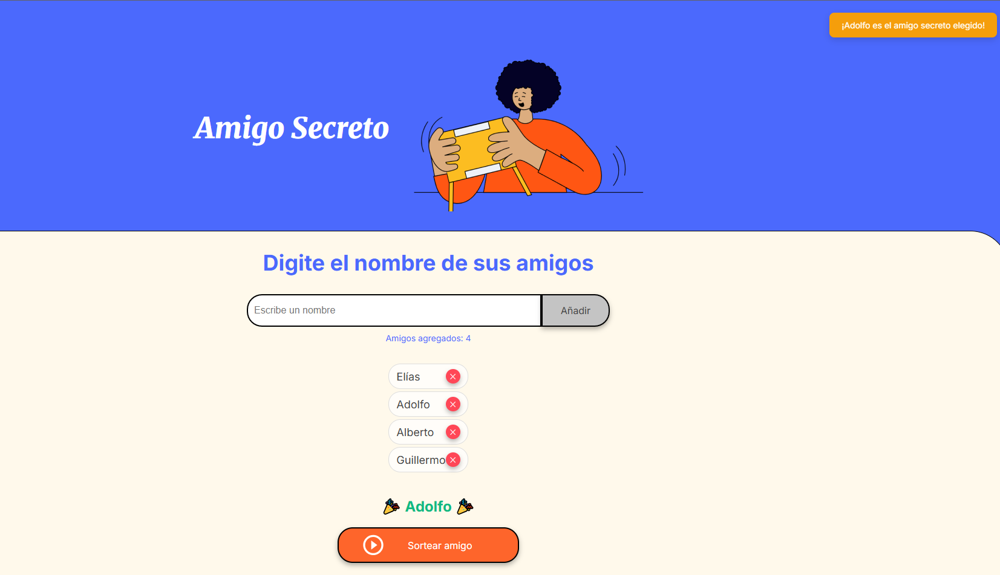

🎁 Amigo Secreto

Una aplicación web simple para organizar sorteos de amigo secreto de forma divertida.

📋 Sobre el Proyecto

Este proyecto fue desarrollado como parte del desafío **Oracle Next Education (ONE)**. Es una aplicación web que permite agregar nombres de amigos y realizar un sorteo aleatorio para elegir el "amigo secreto".

🖼️ Capturas de Pantalla

Pantalla Principal

Agregando Participantes

Resultado del Sorteo

✨ Funcionalidades

- ✅ Agregar nombres de participantes
- ✅ Validar que no estén vacíos o duplicados
- ✅ Eliminar participantes de la lista
- ✅ Sortear un amigo secreto aleatoriamente
- ✅ Mostrar el resultado con animación

🛠️ Tecnologías Utilizadas

- HTML5 - Estructura de la página
- CSS3 - Diseño y estilos
- JavaScript - Lógica del sorteo y validaciones

🚀 Cómo Usar

1. Agregar nombres: Escribe un nombre y presiona "Añadir" o Enter
2. Hacer sorteo: Haz clic en "Sortear amigo" (necesitas mínimo 2 nombres)
3. Ver resultado: ¡Disfruta de la selección aleatoria!

📦 Instalación

1. Clona o descarga este repositorio
2. Abre el archivo `index.html` en tu navegador
3. ¡Listo para usar!

git clone https://github.com/Mithos-Tech/amigo-secreto.git

📁 Estructura de Archivos

amigo-secreto/
├── index.html     # Página principal
├── style.css      # Estilos CSS
├── app.js         # Lógica JavaScript
├── assets/        # Imágenes del proyecto
└── screenshots/   # Capturas de pantalla

🎯 Características Técnicas

Validaciones Implementadas:
- Nombres no pueden estar vacíos
- No permite nombres duplicados
- Longitud mínima de 2 caracteres
- Requiere mínimo 2 participantes para sortear

Funciones Principales:
- agregarAmigo() - Agrega y valida nombres
- sortearAmigo() - Realiza el sorteo aleatorio
- eliminarAmigo() - Elimina participantes individuales

🤝 Sobre el Desarrollador

Mario Liberato  
🎓 Estudiante de Oracle Next Education (ONE)

*Proyecto desarrollado como parte del programa Oracle Next Education - Challenge Amigo Secreto*
